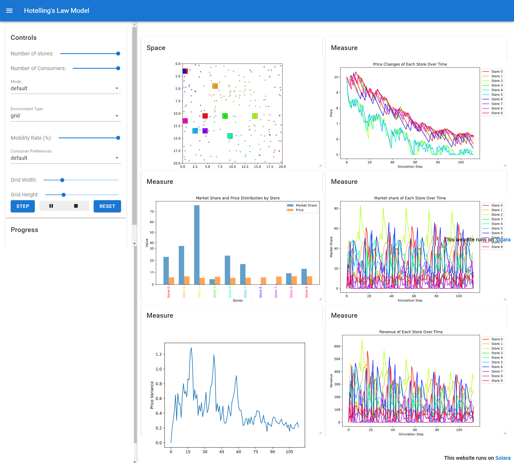

# Hotelling's Law Mesa Simulation

## Overview

This project is an agent-based model implemented using the Mesa framework in Python. It simulates market dynamics based on Hotelling's Law, exploring the behavior of stores in a competitive market environment. Stores adjust their prices and locations if it's increases market share to maximize revenue, providing insights into the effects of competition and customer behavior on market outcomes.

## Hotelling's Law

Hotelling's Law is an economic theory that predicts competitors in a market will end up in a state of minimum differentiation, often referred to as the "principle of minimum differentiation" or "Hotelling's linear city model". This model explores how businesses choose their location in relation to competitors and how this affects pricing and consumer choice.

## Installation

To run this simulation, you will need Python 3.x and the following Python libraries:

- mesa
- scipy

You can install all required libraries by running:

```bash
pip install -r requirements.txt
```

## Project Structure

```plaintext
mesa-examples/
└── examples/
    └── hotelling_law/
        ├── hotelling_law/
        │   ├── __init__.py
        │   ├── model.py
        │   └── agents.py
        ├── __init__.py
        ├── app.py
        ├── cprofile_test.py
        ├── Readme.md
        ├── requirements.txt
        └── tests.py
```

## Running the Simulation

To start the simulation, navigate to the project directory and execute the following command:

```bash
solara run app.py
```

# Project Details

### Professor: [Vipin P. Veetil](https://www.vipinveetil.com/)
### Indian Institute of Management, Kozhikode

### Project by

| Group 8 |                           |               |
|-|---------------------------|---------------|
| Name | Email Id                  | Roll No       |
| Amrita Tripathy | amrita15d@iimk.edu.in     | EPGP-15D-010  |
| Anirban Mondal | anirban15e@iimk.edu.in    | EPGP-15E-006  |
| Namita Das | namita15d@iimk.edu.in     | EPGP-15D-046  |
| Sandeep Shenoy | sandeep15c@iimk.edu.in    | EPGP-15C-076  |
| Sanjeeb Kumar Dhinda | sanjeeb15d@iimk.edu.in | EPGP-15D-074  |
| Umashankar Ankuri | umashankar15d@iimk.edu.in | EPGP-15D-096  |
| Vinayak Nair | vinayak15d@iimk.edu.in    | EPGP-15D-102  |
| Wayne Joseph Unger | wayne15d@iimk.edu.in    | EPGP-15D-104  |


### Hotelling Law Simulation - Visualization
