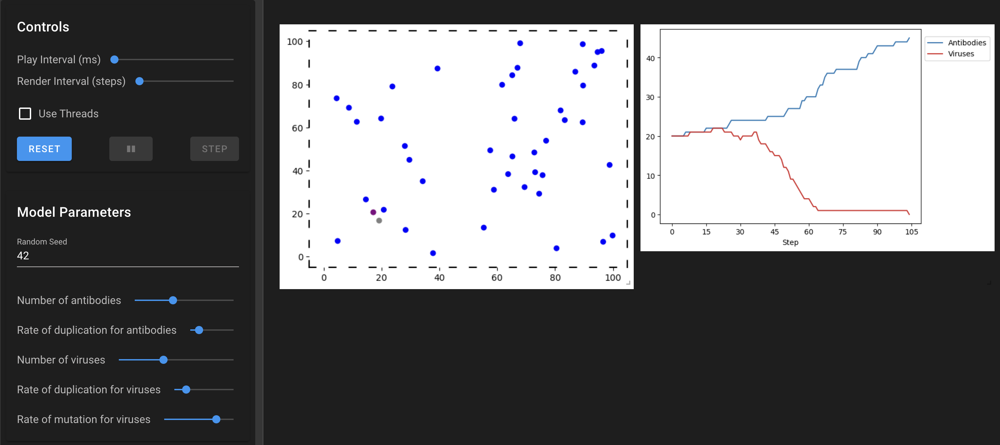
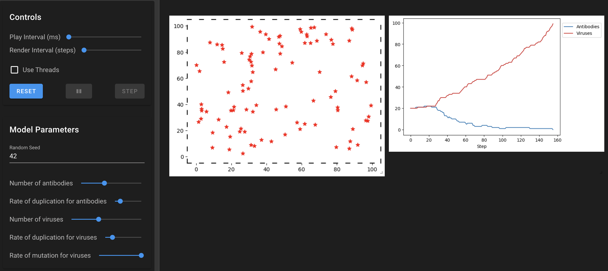
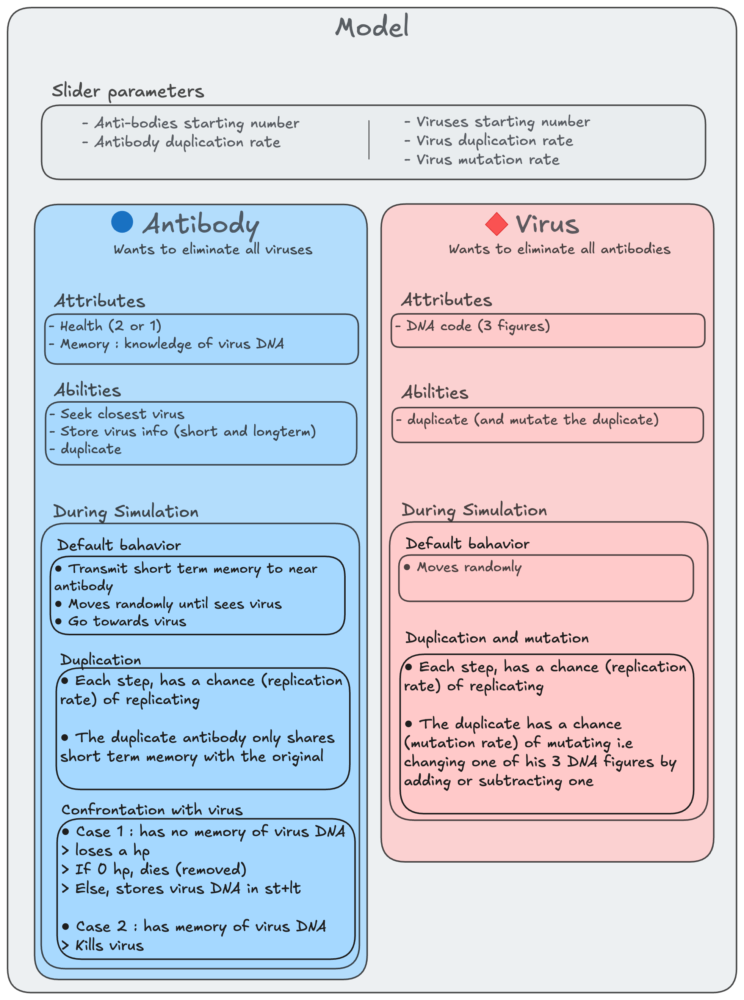
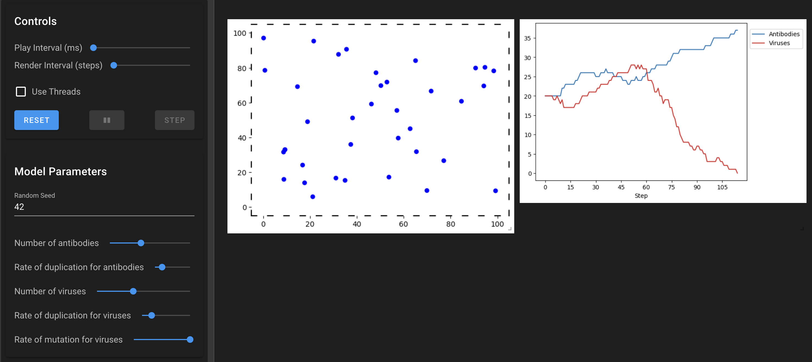
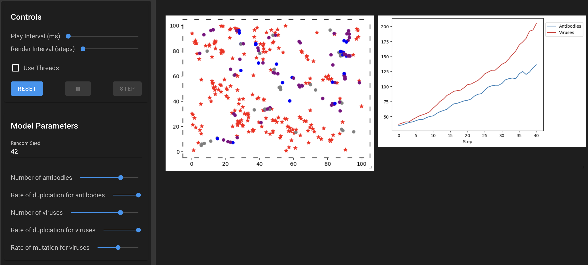

# Virus-Antibody Model

This model is a simulation of immune reaction declined as a confrontation between antibody agents and virus agents. The global idea is to model how the imune system can struggle against new virus but is able to adapt over time and beat a same virus if it comes back. The results are quite interesting as the simulation can go both ways (virus win or antibodies win) with a little tweak in the base parameters.


**It showcases :**
- **Usage of memory in agents** : divided into a short term memory using a deque to easily add and remove memories in case of a new virus encounter, and a long term memory (here a simple list)
- **Agent knowledge sharing** : the antibodies are able to share short term memory)
- **Usage of weak referencing** to avoid coding errors (antibodies can store viruses in a `self.target` attribute)
- Emergence of completely **different outcomes** with only small changes in parameters


For example, with a given set of fixed parameters :
| Virus mutation rate = 0.15 (antibodies win)      | Virus mutation rate = 0.2 (viruses win)          |
|--------------------------------------------------|--------------------------------------------------|
|                    |                       |


## How It Works

1. **Initialization**: The model initializes a population of viruses and antibodies in a continuous 2D space.
2. **Agent Behavior**:
   - Antibodies move randomly until they detect a virus within their sight range (becomes purple), than pursue the virus.
   - Antibodies pass on all the virus DNA in their short term memory to the nearest antibodies (cf. example)
   - Viruses move randomly and can duplicate or mutate.
3. **Engagement (antibody vs virus)**: When an antibody encounters a virus:
   - If the antibody has the virus's DNA in its memory, it destroys the virus.
   - Otherwise, the virus may defeat the antibody, causing it to lose health or become inactive temporarily.
4. **Duplication**: Antibodies and viruses can duplicate according to their duplication rate.


>   Example for memory transmission : Let's look at two antibodies A1 and A2
>   `A1.st_memory() = [ABC]` and `A1.lt_memory() = [ABC]`
>   `A2.st_memory() = [DEF]` and `A2.lt() = [DEF]`
>
>   After A1 encounters A2,
>   `A1.st_memory() = [DEF]` and `A1.lt() = [ABC, DEF]`
>   `A2.st_memory() = [ABC]` and `A1.lt() = [DEF, ABC]`
>
>   A1 and A2 'switched' short term memory but both have the two viruses DNA in their long term memory

For further details, here is the full architecture of this model :

<div align="center">
  
</div>

## Usage

After cloning the repo and installing mesa on pip, run the application with :
```bash
    solara run app.py
```

## A couple more of interesting cases

| An interesting tendency inversion | high duplication + high mutation = both grow (more viruses) | high duplication + low mutation = both grow (more antibodies) |
|---|---|---|
|  |  |  |
