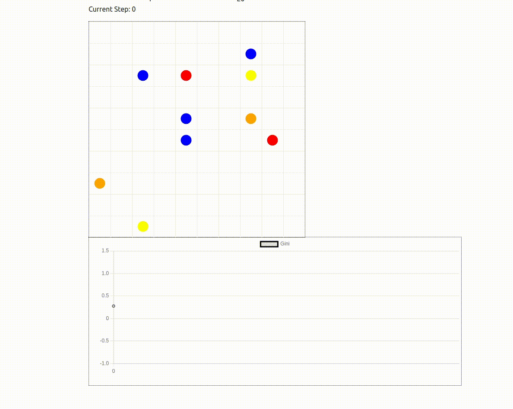

# Balancing Wealth Inequality
This folder showcases how to solve the Boltzmann wealth model with Proximal Policy Optimization (PPO) from Stable Baselines.

## Key features:

- Boltzmann Wealth Model: Agents with varying wealth navigate a grid, aiming to minimize inequality measured by the Gini coefficient.
- PPO Training: A PPO agent is trained to achieve this goal, receiving sparse rewards based on Gini coefficient improvement and a large terminal reward for achieving low inequality.
- Mesa Data Collection and Visualization: The Mesa data collector tool tracks Gini values during training, allowing for real-time visualization.
- Visualization Script: Visualize the trained agent's behavior with Mesa's visualization tools, presenting agent movement and Gini values within the grid. You can run `server.py` file to test it with pre-trained model.

## Model Behaviour
The adgent as seen below learns to move towards a corner of the grid. These brings all the agents together allowing exchange of money between them resulting in reward maximization.

