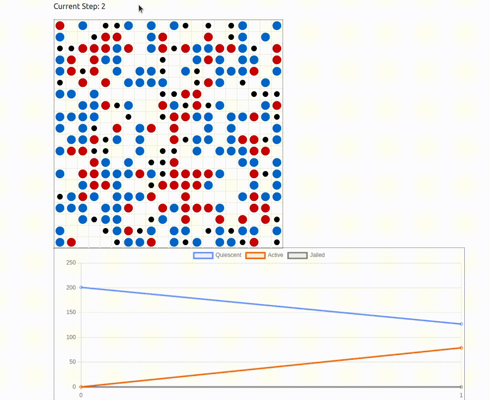

# Modelling Violence: Epstein Civil Violence Model

This project demonstrates the use of the RLlib library to implement Multi-Agent Reinforcement Learning (MARL) in the classic Epstein-Civil Violence problem. The environment details can be found on the Mesa project's GitHub repository [here](https://github.com/projectmesa/mesa-examples/tree/main/examples/epstein_civil_violence).

## Key Features

**RLlib and Multi-Agent Learning**:
- **Library Utilized**: The project leverages the RLlib library to concurrently train two independent PPO (Proximal Policy Optimization) agents.
- **Agents**:
  - **Police**: Aims to control violence (Reduce active agent)
  - **Citizen**: Aims to show resistence (be active) without getting arrested

**Input and Observation Space**:
- **Observation Grid**: Each agent's policy receives a 4 radius grid centered on itself as input.

**Action Space**:
- **Action Space**: For citizen the action space is the ID of the neighboring tile to which the agent wants to move along with choice to be active. For cop the action space is ID of neighbourng tile it wants to move along with ID of active citizen in it's neigbhood that it wants to arrest.
**Behavior and Training Outcomes**:

**Optimal Behavior**:
  - **Cops**: Learns to move towards active agents and arrest them.
  - **Citizens**: Learns to run away from cops and be active only if a cop isn't around.
- **Density Variations**: You can vary the densities of sheep and wolves to observe different results.

By leveraging RLlib and Multi-Agent Learning, this project provides insights into the dynamics of violence in a society and various strategies in a simulated environment.

